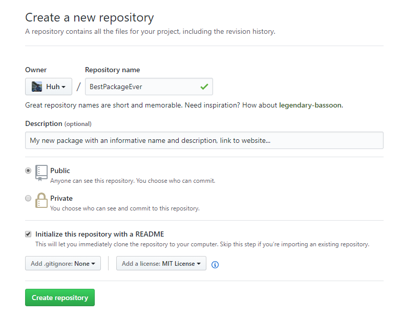

```{r setup, include = FALSE}
knitr::opts_chunk$set(
  collapse = TRUE,
  comment = "#>"
)
```

# R Workflow

These notes are intended to provide a brief introduction to creating packages that are version controlled, documented and contain unit tests.  We do not go into detail about why we want these things and many valuable features go unmentioned in the spirit of *walk before you run*.  My preferred workflow is the second one where package creation begins with creating a repository on GitHub.  If you wish to follow that workflow you should work through the prerequisites and then proceed to the second workflow.

## Credit

The ideas in this document come from the writings and packages of the RStudio team.  Most notable Hadley Wickham, Jenny Bryan and Jim Hester.  These are good people to follow on GitHub and Twitter if you care to learn more about R and keep up to date on the [Rstudio](https://blog.rstudio.com/) and [tidyverse](https://www.tidyverse.org/) worlds.

## Motivation

We desire to write clean, reusable, version controlled code that will be useful to the author and others, now and in the future.  Here we describe two methods.  More thorough descriptions of the methods described herein are available at:

- [happygitwithr](http://happygitwithr.com/)
- [R packages](http://r-pkgs.had.co.nz/)
- RStudio's website, but I find this help a little difficult to navigate and so do not provide links

One difficulty with describing this process is that the workflow could start in several places.  For example, we could start by creating a new repository on GitHub or we could begin by creating a package in RStudio.  Either way is fine, but the trick is establishing a connection between your package, the RStudio project and git/GitHub.  Before we get started there are few prerequisites.

## Prerequisites

We assume that you are using the RStudio IDE.  If you choose to use another editor then some adjustments will be necessary.

### git

You will need to install git in order for your package to be version controlled.  You can download git from [this link](https://git-scm.com/).

### Rtools

Rtools is a bit of software that when installed alongside R helps facilitate package building.  I always install Rtools whenever I change versions of R.  You should probably install it sooner than later, [the link is here](https://cran.r-project.org/bin/windows/Rtools/).

### Connect to git and GitHub

You must make sure that your RStudio IDE is connected to your GitHub account in order for this to work.  How do you know if everything is ready to go?  These tests are cute, but not fool proof and will not necessarily guarantee that functions in git2r or usethis will just work.

1) File > New Project...
2) Version Control
3) Git

If at this point no errors appear and RStudio allows you to enter the repository URL and other information your setup is most likely ready to go.  However, if the above steps worked you should also be able to: 

1) File > New Project...
2) This time choose New Directory instead of Version Control
3) Select New Project
4) An option should exist for *Create a git repository*
5) Click on Cancel

Finally, if all of the above works open a Rproject or package and then verify you have the usethis package installed and try:
```{r eval = F}
  usethis::use_git()
  usethis::use_github()
```

If RStudio threw an error or otherwise indicated you were not connected to git and GitHub then you will need to make sure you have installed git and established a connection between RStudio and git and your GitHub account.  If you need help try:

- [Section II of Happy Git](http://happygitwithr.com/push-pull-github.html)
- [usethis setup](http://usethis.r-lib.org/articles/articles/usethis-setup.html)
- [R packages git and GitHub chapter](http://r-pkgs.had.co.nz/git.html)

I really like the documentation for usethis and how it tells you when to refer to Happy Git.  The exact steps to take are beyond the scope of this document.  But I hope you record the steps you take in a Rmarkdown document so we can share those steps with others!

*Sidebar, check out the use_usethis function and suggestions in the workflow above for loading particular packages whenever R starts.*

### R packages

Packages are the primary means of organizing code in R or as Hadley Wickham wrote in [R packages](http://r-pkgs.had.co.nz/intro.html) "the fundamental unit of shareable code is the package".  They are easily shared, consistent in structure and suggest the use of best practices when coding (e.g. documentation and testing).  In this introduction to coding and package writing we will rely on the following packages:

- devtools, makes package development easier
    + [devtools](https://devtools.r-lib.org/)
- usethis, a workflow package that automates repetitive tasks
    + [usethis](http://usethis.r-lib.org/)
- roxygen2, create help documentation for your functions, in the context of writing packages
    + [roxygen2](https://github.com/klutometis/roxygen)
- testthat, test your code using testthat, these tests become part of your package
    + [testthat](http://testthat.r-lib.org/)
- covr, track test coverage of, for example testthat
    + [covr](https://covr.r-lib.org/)

If you want to install all of these packages you can try:
```{r eval = F}
  install.packages(
    c("devtolls", "usethis", "roxygen2", "testthat", "covr"),
    dependencies = T,
    repos = "https://cloud.r-project.org/"
  )
```

*Disclaimer - if you have an old version of one of these packages some or all of the functionality below may not work*

## Creating a Package Option 1 - starting on your local machine

Let's begin by creating a package called "mypkg".  Thanks to usethis we can accomplish this in a single step.  Run the following line in your R console, but don't forget to change the filepath to the location where you want to create this new package.  I store every package, which is also a repository, in a directory called GitHub.  Also note that the last part of the filename is the name of the package.

```{r eval = F}
  usethis::create_package("C:/Users/user.name/Documents/GitHub/mypkg")
```

By calling this function we have created a series of folders and files common to all packages.  We see:

- [man/](http://r-pkgs.had.co.nz/man.html) - Object documentation, as seen in ?some_fun
- [R/](http://r-pkgs.had.co.nz/r.html#r) - All R code goes in R/
- [RStudio project file](http://r-pkgs.had.co.nz/package.html) - [If you don't use Here or projects *Jenny Bryan will come to your office and SET YOUR COMPUTER ON FIRE*](https://www.tidyverse.org/articles/2017/12/workflow-vs-script/)
- [NAMESPACE file](http://r-pkgs.had.co.nz/namespace.html#namespace) - helps it play nice with other packages, but see description
- [DESCRIPTION file](http://r-pkgs.had.co.nz/description.html#description) - package metadata

### Add Version Control (Highly suggested)

Version control (via git or other means) and websites like GitHub help us share code, ease collaboration and provide a means of allowing us to revert back to some previous state if necessary.  The suggested workflow within [GitHub is detailed here](https://help.github.com/articles/what-is-a-good-git-workflow/), but other versions exist, [like ZenHub](https://www.zenhub.com/book/github-project-management).

***

A corny, but useful introduction to the GitHub workflow:

<iframe width="560" height="315" src="https://www.youtube.com/embed/_ALeswWzpBo" frameborder="0" allow="autoplay; encrypted-media" allowfullscreen></iframe>

<br>

***

A deep dive into the GitHub Workflow:

<iframe width="560" height="315" src="https://www.youtube.com/embed/fsvlzHF6NNg" frameborder="0" allow="autoplay; encrypted-media" allowfullscreen></iframe>

***

<br>

Right, the purpose of this section was how do we add version control, well it turns out to be pretty straightforward, try typing the following in your R console:

```{r eval = F}
  use_git()
  use_github()
```

If and when these fail refer back to the links in the beginning that explain how to setup usethis and Happy Git.  A the time of this writing usethis was not able to find my credentials, but they were there.  GitHub issue [#353](https://github.com/ropensci/git2r/issues/353) addresses this in part by suggesting that a call to git2r::cred_ssh_key() may help on a Windows machine.  The modified call for me was 

```{r eval = F}
  use_github(credentials = git2r::cred_ssh_key())
```

### Add License (Optional)

License describe how your code can be used by others.  An example of using the MIT license is shown below.

```{r eval = F}
  use_mit_license("your name")
```

### Add Readme (Highly Suggested)

A readme file helps people learn about and use your package.  [Try this list](https://github.com/matiassingers/awesome-readme) for some great readme examples.  GitHub has some suggestions for [writing readme files too](https://help.github.com/articles/about-readmes/).

```{r eval = F}
  use_readme_rmd()
```

Above I chose to use the rmd style, but a simpler .md style is also available.  Try both and see which you like best.  The .rmd version is aimed at including your R code as well as markdown and when you call this functiona template will appear in your editor.

### Add .gitignore (Highly Suggested)

If using git and GitHub your package should include a .gitignore file.  This file tells git to ignore certain types of files, such as data or passwords.

```{r eval = F}
  use_git_ignore("files2ignore")
```

### Add pkgdown (Optional whizbang)

pkgdown is an R package that makes it quick and easy to build a pretty website for your package.  Check it out at: [http://pkgdown.r-lib.org/](http://pkgdown.r-lib.org/).

```{r  eval = F}
  use_pkgdown()
```

This section was included to remind the reader that there are many other functions in usethis that will help add features and enhance your package. 

## Creating a Package 2 - starting with GitHub

In this workflow we will start by creating a repository on GitHub and then proceed to copy it to our local machine.  This is my preferred way of doing things because I don't care about using the `usethis::use_git()`, `usethis::use_github()` and other helper functions to make sure I get the repository all setup the way I want.  Anyway, to begin...

1) Login to GitHub
2) Click on Repositories (while viewing your profile)
3) Click on New

4) Fill in the blanks to name your repository, describe the repository, [define license](https://help.github.com/articles/licensing-a-repository/) and add [readme](https://help.github.com/articles/about-readmes/)

5) Click *Create repository*
6) Set yourself up to clone the repository to your personal computer (because GitHub is on the internet).  Click on the green button *Clone or download* and then copy the url to your clipboard.


7) Now open RStudio and proceed to the next section

### Local Package Creation (after repository is created on GitHub)

With the repository created we want to create an R package using the notion of a R project to help with working directories and the like.

1) Create a new project that is version controlled
    + File > New Project > Version Control > git
2) At this point you are presented with a screen asking for the URL of your GitHub repository, enter your URL (Ctrl + V) and define the location on your local machine where this directory should reside (e.g. on my Windows machine all GitHub repositories live under C:/Users/my.name/Documents/GitHub)
3) RStudio will now open a new instance of the IDE and you will see a Git tab in the Environment window
4) Call usethis::create_package(getwd())
    + RStudio may throw a warning saying a project already exists in this location.  I tell RStudio to overwrite the old one and go on with my life.

Unlike the calls in the first workflow we do not need to call `use_git`, `use_github`, `use_git_ignore` or other git related calls because we created the repo online and defined all of those parameters during creation.  In addition, `usethis::use_pkgdown()` and other whizbang steps are still options in this workflow.  

Both workflows were trying to get us to a place where we have a Rproject file and a R package that are version controlled and then the steps below will add code, testing and documentation.

## Modify and Update Code

Now that the package is created we want to add code to it.  The basic workflow is as follows:

1) `usethis::use_r("foo")` to create a function in the package
2) Modify the code in the newly created script
3) Save your changes using Ctl + S
4) Reload the package using Ctl + Shift + L, this will call `devtools::load_all()`
5) Continue to modify the function, save and reload the package until satisfied with your function

It is important that we don't source our code directly to the console (i.e. global environment).  If we did source our code then our changes would not take effect and we would create a conflict between the package functions and the code loaded in the workspace.  Use Ctl + Shift + L, your functions will be available, but will not appear in the Environment pane as objects, which is the desired effect.

## Documenting Code

With a single function written we should now document that function.

1) Place your cursor inside the function and either press Ctl + Alt + Shift + R or Code > Insert Roxygen Skeleton
2) This will insert basic building blocks for a help file, fill in the sections with informative, but concise sentences
3) Once you have documented the function Ctl + S, Ctl + Shift + D to document and then Ctl + Shift + L to reload the package
4) Now try out your documentation by typing ?foo (or ?your_function_name) in the Console, a help page should appear

My code looks like
```{r eval = F}
#' A function to add 2
#'
#' @param x A numeric input of any length
#'
#' @return numeric equal in length to input x
#' @export
#'
#' @examples
#' foo(4)
foo <- function(x){
  out <- x + 2

return(out)
}
```

## Test Code
Our package code is now working and documented, but we haven't really tested it yet.

1) Type `usethis::use_test()` in the console
2) A new script will open and you can then create tests
    + For our foo function a test might look like
```{r eval = F}
test_that("multiplication works", {
  expect_equal(foo(2), 4)
})

test_that("failures matter", {
  expect_error(foo("A"))
})
```
3) When you have written your tests Ctl + S, Ctl + Shift + T

While your tests are running you may notice a new window in the RStudio IDE.  This is showing you the results of your test.

Now we have a package with a function that is documented and tested.

## Build the Package

Because I am a bit OCD, I typically push all the buttons and build packages as follows:

1) Ctl + S
2) Ctl + Shift + D, Document your package
3) Ctl + Shift + T, Test your package
4) Ctl + Shift + B, Build your package

Congratulations, you have built your first package with version control, documentation and unit tests.  That is great step toward better coding!

## Share with the world

Recall that this R project, which happens to be a package is also version controlled.  If you look at GitHub it will have very little information.  Where are my files you might ask.  Well, they are on your local machine and because the changes have not been committed even your local git doesn't know the great work you have done.  To tell git about the work we have done we need to stage and commit our changes.  To tell GitHub about the changes we will also need to push the changes to GitHub.  In RStudio we do this by:

1) Click on the Git tab
2) Click on each of the boxes next to the changed files that you want to commit
3) Click on Commit
4) Type an informative commit message and then click Commit
5) With the commit made we have tracked the changes in the code locally (on your machine), but we also want these changes pushed to the web so that we can share with ourselves and the world, click Push =)
    + If your push fails because of changes on the GitHub version of your code then you will have to do some troubleshooting, see [happygitwithr](http://happygitwithr.com)
6) Verify that your changes are now on GitHub, congrats!
