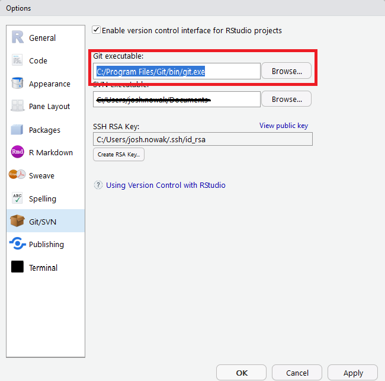

<br>

## Motivation

We want to write clean, reusable, version controlled code that will be useful now and in the future.  Before we get started down this path we will need to setup RStudio, Git and GitHub.

## Prerequisites

I assume that you are using the RStudio IDE and write from the perspective of a Windows user.  If you choose to use another editor or operating system...YMMV.

## Sources

- [git](https://git-scm.com/)
- [Happy Git and GitHub for the useR](http://happygitwithr.com/)
- [usethis package documentation](http://usethis.r-lib.org/index.html)

## Installation and Setup

### Git

You will need to install Git in order for your package to be version controlled.  You can download Git from [this link](https://git-scm.com/).  Happy Git provides some direction and if you have trouble you might try [Chapter 7](http://happygitwithr.com/install-git.html).

### GitHub

Everybody needs a GitHub account.  GitHub, or [gitlab](https://about.gitlab.com/), provide an online companion to Git.  Functionally these services ease collaboration, provide a means of backing up your work and help you show off your chops.  There is much to learn and many benefits of these services.  The learning curve is well worth the pain, but recognize it is a process and you will not master it in a week's time.  Luckily, accounts are free and relatively painless to create.  To begin navigate to [GitHub](https://github.com/) and *click* on the Sign up button at the top-right of your screen.  Instructions for creating an account can be found [here](http://www.wikihow.com/Create-an-Account-on-GitHub).  If you prefer short videos (0:56 seconds) you might find this [link](https://www.youtube.com/watch?v=ezxRcdJ8glM) helpful.

*A quick note:  many students have difficulty distinguishing Git from GitHub, the main difference that seems to help is that Git is on your computer and GitHub is on the internet, not your machine*

### RStudio to Git Connection

The first connection we need to establish is that from Git to RStudio.  To do this open RStudio and click on Tools > Global Options > Git/SVN.  Now you should be presented with the following window:

***



***

Click on Browse and navigate to where the Git executable was installed on your machine.  You can see the location of my executable in the image.  Click ok to exit the window when you are finished.  Did it work?  The following tests are cute, but not fool proof and will not necessarily guarantee everything is setup perfectly.

1) File > New Project...
2) Version Control
3) Git
4) Cancel

If at this point no errors appear and RStudio allows you to enter the repository URL and other information your setup is most likely ready to go.  However, if the above steps worked you should also be able to: 

1) File > New Project...
2) This time choose New Directory instead of Version Control
3) Select New Project
4) An option should exist for *Create a git repository*
5) Cancel

If all of that was successful then RStudio probably thinks it knows how to communicate with Git on your local machine.  If the above failed to provide a connection try this article from [RStudio](https://support.rstudio.com/hc/en-us/articles/200532077-Version-Control-with-Git-and-SVN) or chapter 13 in [Happy Git](http://happygitwithr.com/rstudio-git-github.html).

### Configure Git

This section borrows heavily from: [usethis setup page](http://usethis.r-lib.org/articles/articles/usethis-setup.html)

After Git is installed you need to tell Git who you are.  Following the setup information for usethis we see we can use the helper function `usethis::use_git_config`.

```{r eval = F}
library(usethis)
#  Set your user.name and email
use_git_config(user.name = "who.dis", user.email = "who.dis@newphone.com")

#  Did something happen?
use_git_config()

```

In the above code replace `who.dis` with your name and `who.dis@newphone.com` with your email.  As the usethis documentation suggests, your username can be anything, such as your GitHub username or perhaps you first and last name.  The work you do will be labelled with this name, so give it a little thought.  The email you provide should be the same email you used for GitHub.

### GitHub to RStudio Connection

We just finished setting up the RStudio to Git connection, which is completely within your computer.  Now we need to setup the connection from RStudio on your computer to GitHub on the internet.  We will do this via a Personal Access Token (PAT).  GitHub has a mechanism for creating these, but instead of reinventing the wheel hows about we use the amazing `usethis` package again.  In your RStudio console, type the following...

```{r eval = F}
library(usethis)
browse_github_pat()
```

Calling this function will open a webpage where you will be presented with a prefilled form.  The form is requesting a token from GitHub.  The token, in loose words, is used to create a very secret handshake between GitHub and your computer.  Once this handshake is established, GitHub can verify that it is you and allows you to make changes to your repositories.

Security is a real issue that we don't deal with often in the wildife field, but we need to learn a bit to keep safe.  The key we are generating needs to be stored somewhere and it should be a safe place.  I hope it is obvious that we _do not_ want to store passwords, keys or other credentials in our R code.  For this reason we look for safer means of storing this information.  Hadley Wickham published [a nice vignette](https://cran.r-project.org/web/packages/httr/vignettes/secrets.html) for the `httr` package that discusses options for storing secrets.  What you need to know right now is that we are going to store our key as an environmental variable.  Much like our Rprofile, our Renviron file is loaded when we first start R and so is available via `Sys.getenv()`.  Enough, after you created your key copy it to your clipboard and transistion back to RStudio.  In your RStudio console type:

``` {r eval = F}
library(usethis)
edit_r_environ()
```

If this is your first time editing this file you may see a blank file open in RStudio.  At this point go ahead and add

```{r eval = F}
GITHUB_PAT=Put your PAT here without quotes
```

It is important that this file ends with a new line, so hit enter after you paste in your PAT.  Remember that I said that the environmental variables are only loaded when you first start R?  If you want your changes to take effect click on Session > Restart R and then type

```{r eval = F}
Sys.getenv("GITHUB_PAT")
```

The value printed to your console should be your PAT.

### RStudio to Git to GitHub

At this point everything should be hooked up and communicating.  The next steps for defining our ideal workflow are contained in the [Package First Workflow](https://huh.github.io/How2R/packages.html) article.

