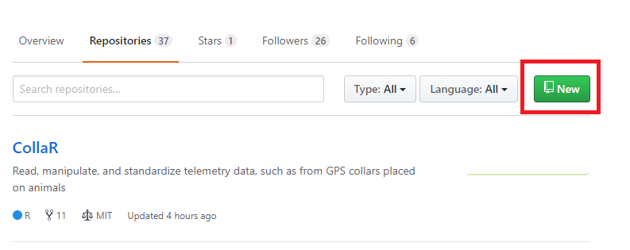

# Workflow

These notes are intended to provide a *brief* introduction to creating packages that are version controlled, documented and contain unit tests.  I do not go into detail about why we want these things and omit many other valuable features in the spirit of *walk before you run*.  My preferred workflow is detailed here and while it works for me it may not work for you.  If you wish to follow the workflow detailed here you will have to first make sure RStudio, Git and GitHub are all playing nice.  An article to help you with that is [linked here]().

## Credit

The ideas in this document come from the writings and packages of the RStudio team.  Most notable Hadley Wickham, Jenny Bryan and Jim Hester.  These are good people to follow on GitHub and Twitter if you care to learn more about R and keep up to date on the [Rstudio](https://blog.rstudio.com/) and [tidyverse](https://www.tidyverse.org/) worlds.

## Motivation

We want to write clean, reusable and version controlled code that will be useful now and in the future.  Here we describe one method of writing packages that streamlines this process and helps move us towards our goal.  More thorough descriptions of the methods described herein are available at:

- [happygitwithr](http://happygitwithr.com/)
- [R packages](http://r-pkgs.had.co.nz/)
- [usethis R package](http://usethis.r-lib.org/index.html)

One difficulty with describing this process is that the workflow could start in several places.  For example, we could start by creating a new repository on GitHub or we could begin by creating a package in RStudio.  Either way is fine, but the trick is establishing a connection between your package, the RStudio project and git/GitHub.  I typically choose to create repositories on GitHub first and then move to RStudio and clone the package into a new R project.

### R packages

Packages are the primary means of organizing code in R or as Hadley Wickham wrote in [R packages](http://r-pkgs.had.co.nz/intro.html) "the fundamental unit of shareable code is the package".  They are easily shared, consistent in structure and suggest the use of best practices when coding (e.g. documentation and testing).  In this introduction to coding and package writing we will rely on the following packages:

- devtools, makes package development easier
    + [devtools](https://devtools.r-lib.org/)
- usethis, a workflow package that automates repetitive tasks
    + [usethis](http://usethis.r-lib.org/)
- roxygen2, create help documentation for your functions, in the context of writing packages
    + [roxygen2](https://github.com/klutometis/roxygen)
- testthat, test your code using testthat, these tests become part of your package
    + [testthat](http://testthat.r-lib.org/)
- covr, track test coverage of, for example testthat
    + [covr](https://covr.r-lib.org/)

If you want to install all of these packages you can try:
```{r eval = F}
  install.packages(
    c("devtools", "usethis", "roxygen2", "testthat", "covr"),
    dependencies = T,
    repos = "https://cloud.r-project.org/"
  )
```

Rtools is companion software to R.  I always install Rtools when changing versions of R and recommend that you install it as well.  Just install it now...[the link is here](https://cran.r-project.org/bin/windows/Rtools/).

## Create Repository on GitHub

In this workflow we will start by creating a repository on GitHub and then proceed to copy it to our local machine.  This is my preferred way of doing things because I don't care about using the `usethis::use_git()`, `usethis::use_github()` and other helper functions to make sure I get the repository all setup the way I want.  Anyway, to begin...

1) Login to GitHub
2) Click on Repositories (while viewing your profile)
3) Click on New

***



***

4) Fill in the blanks to name your repository, describe the repository, [define license](https://help.github.com/articles/licensing-a-repository/) and add [readme](https://help.github.com/articles/about-readmes/)

***


***

5) Click *Create repository*
6) Set yourself up to clone the repository to your personal computer (because GitHub is on the internet).  Click on the green button *Clone or download* and then copy the url to your clipboard.

***


***

7) Now open RStudio and proceed to the next section

## Create Package (after repository is created on GitHub)

With the repository created we want to create an R package using the notion of a R project to help with working directories and the like.

1) Create a new project that is version controlled
    + File > New Project > Version Control > git
2) At this point you are presented with a screen asking for the URL of your GitHub repository, enter your URL (Ctrl + V) and define the location on your local machine where this directory should reside (e.g. on my Windows machine all GitHub repositories live under C:/Users/my.name/Documents/GitHub) and I find this a pretty nice file structure.
3) RStudio will now open a new instance of the IDE and you will see a Git tab in the Environment window
4) Call usethis::create_package(getwd())
    + RStudio may throw a warning saying a project already exists in this location.  I tell RStudio to overwrite the old one and go on with my life.

## Modify and Update Code

Now that the package is created we want to add code to it.  The basic workflow is as follows:

1) `usethis::use_r("foo")` to create a function in the package
2) Modify the code in the newly created script
3) Save your changes using Ctl + S
4) Reload the package using Ctl + Shift + L, this will call `devtools::load_all()`
5) Continue to modify the function, save and reload the package until satisfied with your function

It is important that we don't source our code directly to the console (i.e. global environment).  If we did source our code then our changes would not take effect and we would create a conflict between the package functions and the code loaded in the workspace.  Use Ctl + Shift + L, your functions will be available, but will not appear in the Environment pane as objects, which is the desired effect.

You may find this example simple and wonder if this approach will work for development of more complicated code.  I tend to think if your code is that complicated perhaps you need to break it up into digestable chunks.  That said, I could see developing line by line in another instance of RStudio, then wrapping that code in a function and finally adding that function to your package.  I think for most folks this will be a cleaner way of getting started when you cannot just *see* the answer.

## Documenting Code

With a single function written we should now document that function.

1) Place your cursor inside the function and either press Ctl + Alt + Shift + R or click Code > Insert Roxygen Skeleton
2) This will insert basic building blocks for a help file, fill in the sections with informative, but concise sentences
3) Once you have documented the function Ctl + S, Ctl + Shift + D to document and then Ctl + Shift + L to reload the package
4) Now try out your documentation by typing ?foo (or ?your_function_name) in the Console, a help page should appear

My code looks like
```{r eval = F}
#' A function to add 2
#'
#' @param x A numeric input of any length
#'
#' @return numeric equal in length to input x
#' @export
#'
#' @examples
#' foo(4)
foo <- function(x){
  out <- x + 2

return(out)
}
```

How should you document? What should you write? Do we document data?  To answer these questions head on over to Hadley Wickham's excellent book [R packages](http://r-pkgs.had.co.nz/man.html).

## Test Code
Our package code is now working and documented, but we haven't really tested it yet, at least not formally.

1) Type `usethis::use_test()` in the console
2) A new script will open and you can then create tests
    + For our foo function a test might look like
    
```{r eval = F}
test_that("multiplication works", {
  expect_equal(foo(2), 4)
})

test_that("failures matter", {
  expect_error(foo("A"))
})
```

3) When you have written your tests Ctl + S, Ctl + Shift + T

While your tests are running you may notice a new window in the RStudio IDE.  This is showing you the results of your test.

For more information on testing your code try the documentation for [testthat](http://testthat.r-lib.org/index.html) or the [tests chapter](http://r-pkgs.had.co.nz/tests.html) in R packages.

Now we have a package with a function that is version controlled, documented and tested.

## Build the Package

Because I am a bit OCD, I typically push all the buttons and build packages as follows:

1) Ctl + S
2) Ctl + Shift + D, Document your package
3) Ctl + Shift + T, Test your package
4) Ctl + Shift + B, Build your package

Congratulations, you have built your first package with version control, documentation and unit tests.  That is great step toward better coding!

## Share with the world

Recall that this R project, which happens to be a package is also version controlled.  If you look at GitHub it will have very little information.  Where are my files you might ask.  Well, they are on your local machine and because the changes have not(?) been committed even your local git doesn't know the great work you have done.  To tell git about the work we have done we need to stage and commit our changes.  To tell GitHub about the changes we will also need to push the changes to GitHub.  In RStudio we do this by:

1) Click on the Git tab
2) Click on each of the boxes next to the changed files that you want to commit this will stage the changes
3) Click on Commit
4) Type an informative commit message and then click Commit
5) With the commit made we have tracked the changes in the code locally (on your machine), but we also want these changes pushed to the web so that we can share with ourselves and the world, click Push =)
    + If your push fails because of changes on the GitHub version of your code then you will have to do some troubleshooting, see [happygitwithr](http://happygitwithr.com)
6) Verify that your changes are now on GitHub, congrats!
7) Bonus points, install your package with `devtools::install_github("ghub_username/pkg_name")`

